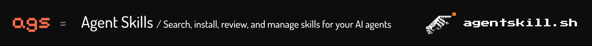
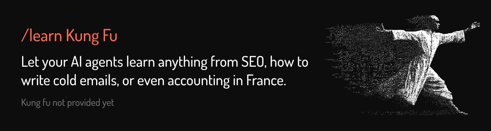

<p align="center">
  
</p>

<p align="center">
  <a href="https://www.npmjs.com/package/@agentskill.sh/cli"></a>
  <a href="https://www.npmjs.com/package/@agentskill.sh/cli"></a>
  
  <a href="https://github.com/agentskill-sh/ags/blob/main/LICENSE"></a>
  <a href="https://github.com/agentskill-sh/ags/stargazers"></a>
</p>

<br />

---

## Quick Start

Copy-paste this into your AI agent (Claude Code, Cursor, Copilot, Codex, Windsurf, Gemini CLI, etc.):

```
Install the /learn skill from https://github.com/agentskill-sh/ags then search for skills relevant to this project
```

That's it. Your agent will install `/learn`, analyze your project, and suggest relevant skills from a directory of 100,000+.

<details>
<summary>Other install methods</summary>

**Plugin marketplace (Claude Code)**

```bash
/plugin marketplace add https://agentskill.sh/marketplace.json
/plugin install learn@agentskill-sh
```

**CLI (terminal)**

```bash
npx ags search "react best practices"
npx ags install seo-optimizer
```

Or install globally:

```bash
npm install -g @agentskill.sh/cli
ags search react
```

**Git clone**

```bash
# Claude Code
git clone https://github.com/agentskill-sh/ags.git ~/.claude/skills/ags

# Cursor
git clone https://github.com/agentskill-sh/ags.git ~/.cursor/skills/ags
```

</details>

---

<p align="center">
  
</p>

## Why /learn and agentskill.sh?

**Two-layer security.** After incidents like [OpenClaw](https://www.koi.ai/blog/openclaw-when-ai-skills-attack) showed how malicious skill files can compromise agents, vetting matters. agentskill.sh runs server-side static analysis on every skill across 12 threat categories:

> Command injection, data exfiltration, credential harvesting, prompt injection, obfuscation, sensitive file access, persistence mechanisms, external calls, reverse shells, destructive commands, social engineering, supply chain attacks

Each skill gets a security score (0-100). 110,000+ skills scanned, 100% coverage. Skills scoring below 30 require explicit confirmation before installation. Then `/learn` performs a second client-side scan before writing any files, so you get both centralized scanning and local verification. [See the live security dashboard.](https://agentskill.sh/security)

**Feedback loop.** Agents auto-rate skills after use (1-5 scale with comments), so the best ones surface and broken ones get flagged by the community. Your agent contributes to, and benefits from, collective quality signals.

**Version tracking.** Every installed skill is tagged with a content SHA, so you always know exactly what version you're running. When a newer version is available, `/learn update` shows what changed. Nothing breaks silently.

**Search broadly.** Instead of hunting for skills manually, search 100,000+ skills mid-conversation. Find what you need, install it, keep working.

---

## What is this?

This repo contains the official CLI and skills for [agentskill.sh](https://agentskill.sh).

| What | Description |
|------|-------------|
| **`ags` CLI** | Terminal tool to search, install, list, update, remove, and rate skills. Published to npm as [`@agentskill.sh/cli`](https://www.npmjs.com/package/@agentskill.sh/cli). |
| **`/learn` skill** | Agent skill that gives your AI the same capabilities mid-conversation. Uses the CLI under the hood. |
| **`review-skill` skill** | Reviews SKILL.md files against best practices and scores them on 10 quality dimensions. |

---

## CLI Commands

```bash
ags search <query>              # Search 100,000+ skills
ags install <slug>              # Install a skill
ags install @owner/skill-name   # Install from specific author
ags list                        # Show installed skills
ags update                      # Check for and apply updates
ags remove <slug>               # Uninstall a skill
ags feedback <slug> <1-5> [msg] # Rate a skill
```

All commands support `--json` for structured output.

---

## /learn Commands

When using the skill inside your agent:

| Command | What it does |
|---------|--------------|
| `/learn <query>` | Search for skills, interactive install |
| `/learn @owner/slug` | Install a specific skill |
| `/learn skillset:<slug>` | Install a curated bundle |
| `/learn` | Context-aware recommendations based on your project |
| `/learn trending` | Show trending skills |
| `/learn list` | Show installed skills |
| `/learn update` | Check for updates |
| `/learn remove <slug>` | Uninstall a skill |
| `/learn feedback <slug> <1-5>` | Rate a skill |

---

## Examples

```bash
# Find SEO skills
ags search "programmatic seo"

# Install a specific skill from an author
ags install @anthropics/react-best-practices

# Install for Cursor instead of Claude Code
ags install seo-optimizer --platform cursor

# Rate a skill you used
ags feedback seo-optimizer 5 "Excellent keyword clustering"

# Update all installed skills
ags update

# List installed skills as JSON
ags list --json
```

---

## How It Works

1. **Search** queries the agentskill.sh API
2. **Install** writes the skill to your platform's skill directory (e.g., `.claude/skills/`)
3. **Metadata header** is injected for version tracking and auto-review
4. **Auto-review**: after using a skill, your agent rates it automatically (1-5 scale)
5. **Update** compares local content hashes against the registry and re-installs outdated skills

---

## Supported Platforms

The CLI auto-detects your platform. Override with `--platform <name>`.

| Platform | Skill directory | Flag |
|----------|----------------|------|
| Claude Code | `.claude/skills/` | `claude-code` |
| Cursor | `.cursor/skills/` | `cursor` |
| GitHub Copilot | `.github/copilot/skills/` | `copilot` |
| Codex | `.codex/skills/` | `codex` |
| Windsurf | `.windsurf/skills/` | `windsurf` |
| Gemini CLI | `.gemini/skills/` | `gemini-cli` |
| Amp | `.amp/skills/` | `amp` |
| Goose | `.goose/skills/` | `goose` |
| Aider | `.aider/skills/` | `aider` |
| Cline | `.cline/skills/` | `cline` |
| Roo Code | `.roo-code/skills/` | `roo-code` |
| Trae | `.trae/skills/` | `trae` |
| Hermes | `~/.hermes/skills/` | `hermes` |
| OpenCode | `.opencode/skills/` | `opencode` |
| ChatGPT | `.chatgpt/skills/` | `chatgpt` |

---

## Security

Every skill on agentskill.sh has a security score (0-100). Skills below 30 trigger a warning before installation.

The `/learn` skill includes a [security pattern library](skills/learn/references/SECURITY.md) for detecting prompt injection, data exfiltration, obfuscated code, and other threats.

---

## Repo Structure

```
.
├── README.md
├── package.json              # npm: @agentskill.sh/cli
├── src/                      # CLI source
│   ├── index.ts
│   ├── api.ts
│   ├── platform.ts
│   └── commands/
│       ├── search.ts
│       ├── install.ts
│       ├── list.ts
│       ├── remove.ts
│       ├── update.ts
│       └── feedback.ts
├── skills/
│   ├── learn/                # /learn skill
│   │   ├── SKILL.md
│   │   └── references/
│   │       └── SECURITY.md
│   └── review-skill/       # Skill quality reviewer
│       ├── SKILL.md
│       └── references/
│           └── rubric.md
├── assets/
│   └── banner.jpg
├── .claude-plugin/           # Claude plugin marketplace
└── LICENSE
```

---

## Contributing

Found a bug? Want to add a platform or a new skill? PRs welcome.

For creating and publishing your own skills, see the [skill creation guide](https://agentskill.sh/readme#how-to-create-a-skill).

---

## Learn More

- [Browse 100,000+ skills](https://agentskill.sh)
- [What is an Agent Skill?](https://agentskill.sh/readme)
- [Create your own skill](https://agentskill.sh/readme#how-to-create-a-skill)
- [Installation guide](https://agentskill.sh/install)

---

## License

MIT

---

<p align="center">
  Built by <a href="https://agentskill.sh">agentskill.sh</a>
</p>
